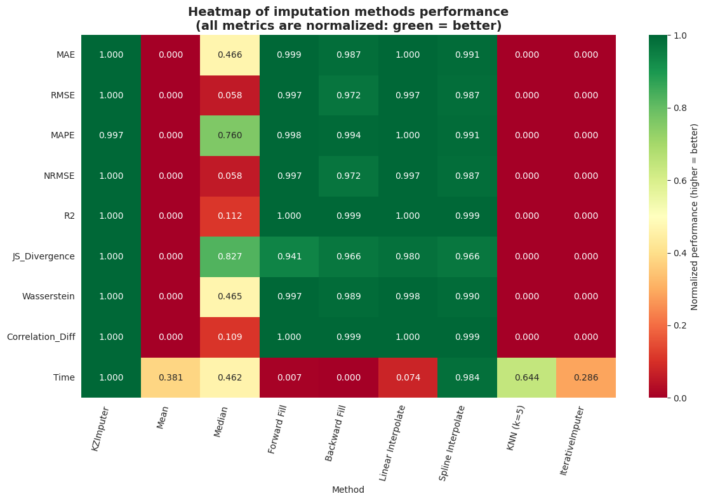

```
wind-data-imputation/
├── data/
│   └── .gitkeep             # CSV files
├── notebooks/
│   └── analysis.ipynb       # Jupyter Notebooks for analysis and visualization
├── results/
│   └── *.jpg (png)          # graphical results (visualizations) of analysis
├── src/
│   └── __init__.py
│   └── custom_imputer.py    # new class (method)
├── src_old/
│   └── *.py                 # old implementations of the proposed method
├── .gitignore               # standard gitignore for Python
├── README.md                # project rescription
└── requirements.txt         # project requirements
```

# Multiple Data-Driven Missing Imputation

This project is a Python implementation and benchmarking of the missing data imputation method described in the scientific paper "Multiple Data-Driven Missing Imputation" by Sergii Kavun and Alina Zamula.

The implementation is implemented as a scikit-learn-compatible class, which makes it easy to use in machine learning pipelines.

## Project structure

- `src/custom_imputer.py`: Implementation of the `KZImputer` imputer.
- `data/`: Directory for storing data.
- `notebooks/analysis.ipynb`: Jupyter Notebook with the full analysis, including:
- Testing on synthetic data adn well known datasets.
- Downloading and preparing real data from Kaggle.
- Benchmarking with 8 other popular imputation methods.
- Visualization of results.
- `requirements.txt`: List of project dependencies.

## Installation

1. Clone the repository:
   ```bash
   git clone https://github.com/s-kav/kz_data_imputation.git
   cd kz_data_imputation

   ```

2. Install the required dependencies:
   ```bash
   pip install -r requirements.txt
   ```

## Data

The analysis uses the [Wind Turbine Scada Dataset](https://www.kaggle.com/datasets/berkerisen/wind-turbine-scada-dataset) from Kaggle.

1. Download the dataset (Kaggle authentication is required).
2. Unzip the archive and place the `T1.csv` file in the `data/` directory.

## Usage

Open and execute the cells in Jupyter Notebook `notebooks/analysis.ipynb` to reproduce the analysis.

## Results

A comparative analysis on real wind turbine power data showed that the `KZImputer` method is competitive, especially compared to simple methods (mean, ffill). In our test, it showed results close to spline and linear interpolation, which turned out to be the best for this type of smooth time series.

### Table comparison with 8 different methods (before `KZImputer` optimization)


### Table comparison with 8 different methods (after `KZImputer` optimization)


### Methods comparison by 8 different metrics


### Behaviour `KZImputer` at the different size of gaps


### Visual comparison of 8 different imputting methods by all metrics


### Methods comparison by 8 different metrics (other visualization)


### Heatmap of imputation methods performance


### Table comparison of 8 different methods with ranking


[](https://doi.org/10.5281/zenodo.15663429)
